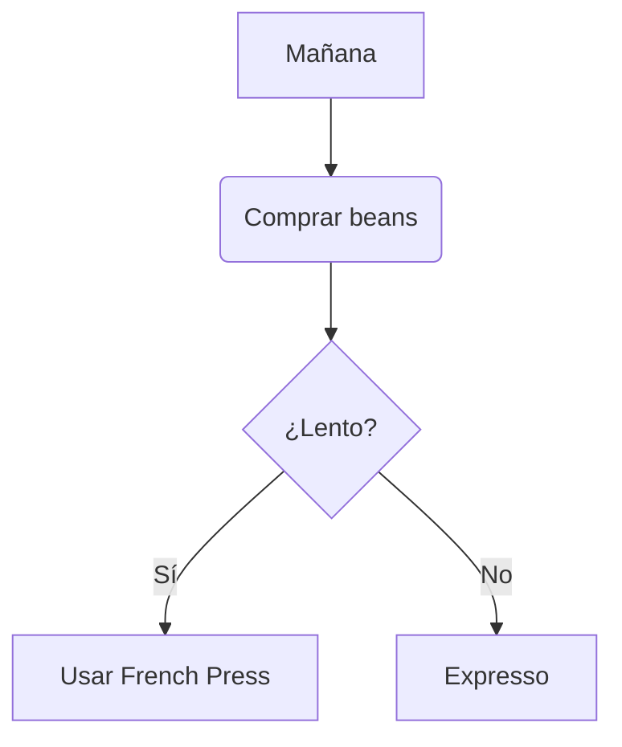

Aquí tienes más ejemplos avanzados y extensiones de Markdown, incluyendo funcionalidades específicas de plataformas como GitHub, GitLab o Jupyter:

---

### **Elementos Avanzados y Especiales**

#### 1. **Tablas con Alineación y Combinación**
```markdown
| Atributo | Valor      | Estado  |
|----------|------------|---------|
| Peso    | 150g       | ✅       |
| Color   | Transparente | ⚠️      | 
|         | *detalles*  | [Ver](#) |
```

#### 2. **Código con Resaltado Sintáctico** *(syntax highlighting)*
```markdown
```python
def coffee(brew: str):
    print(f"Brew method: {brew}")
```
```

#### 3. **Task-lists para Proyectos** *(soportado en GitHub/GitLab)*
```markdown
- [x] Comprar café
  - [x] Grano
  - [ ] Molienda
- [ ] Preparación
```

---

### **Extensions Especiales**

#### 4. **Detalles Expandidos** *(Details Block)*
```markdown
<details>
<summary>Click para ver detalles</summary>
Este texto solo se muestra al expandir.
```python
print("¡Ejemplo!")
```
</details>
```

#### 5. **Expresiones Matemáticas** *(en GitHub/GitLab con extensión)*
```markdown
La velocidad es $$ v = \sqrt{2g h} $$.  
O incrustado: $E=mc²$
```

#### 6. **Diagramas Conectados** *(con Mermaid)*
```markdown

```

---

### **Microformatos y Shortcodes**

#### 7. **Emoji y Emojis Personalizados** *(SVG/JPG también válidos en repos)*
```markdown
✅ Listo ✨ ¡Mágico!  

  
*(para temas oscuros en GitHub)*
```

#### 8. **YAML Front Matter (Hugo/Jekyll)**
```markdown
---
title: "Guía de Café"
date: 2023-10-10
tags: [café, recetas]
---
```

#### 9. **Citas Anidadas**
```markdown
> El café:  
> > La bebida más popular del mundo  
> *[Fuente](#)*
```

---

### **Errores Comunes y Trucos**

- **Line Breaks (Salto de línea forzado)**  
  Usa `\` al final de la línea o doble espacio + Enter:
  ```markdown
  Esta línea forzada: Esto es una línea\  
  continua pero con salto visual.  
  ```

- **Escapers**  
  ```markdown
  Para evitar formato: \*no italica*
  ```

- **Enlaces Anidados**
  ```markdown
  [Ver la receta][link] aquí.  
  [link]: /recetas/cafe
  ```

---

### **Archivo Markdown Completo Ejemplo**
```markdown
---
title: "Receta Avanzada"
---

# café artesanal: Guía Profesional 🌿

## Instrucciones
1. Moler entre **10-15s**.
2. Ver la tabla:
  
| Grano    | Molienda |
|---------|---------|
| Duro    | 1mm     |
| Medio   | 2mm     |

<details>
<summary>Consejos Extra</summary>
- Usaragua a **92°C**
- [Ver video tutorial](#)
```python
def mearc():
    return "¡Excelente!"
```
</details>

---
¡Gracias por leer!
---
```

---

### **Observaciones**
- **Soporte de la Plataforma**: Características como tablas, checklists o diagrams dependen del reader (GitHub, Jupyter, Notion, etc.).
- **Markdown Extra** (GitHub flavored markdown tiene SVG y tablas extendidas).

¿Quieres un ejemplo de alguno de estos en contexto real? 😊